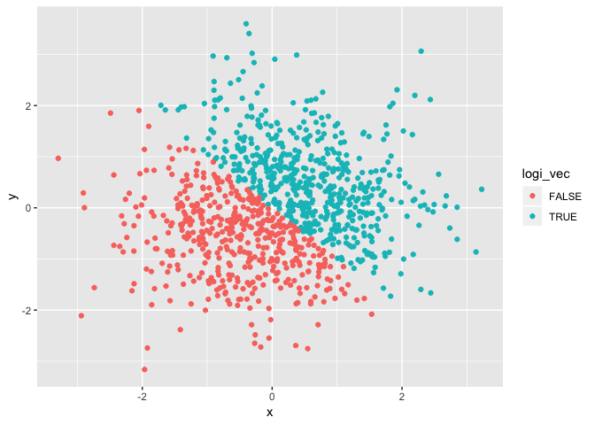
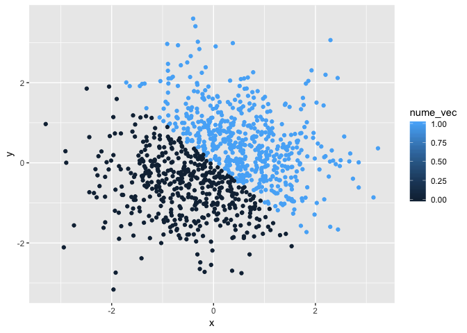

p8105\_hw1\_jz3036.Rmd
================
Junyuan Zheng (jz3036)
2018-09-13

Homework 1

Problem 1
=========

Create a data frame comprised of:
---------------------------------

-   A random sample of size 10 from a uniform\[0, 5\] distribution:

``` r
samp = runif(10, min=0, max=5)
samp
```

    ##  [1] 2.8734551 1.5220679 3.7906840 1.7638142 0.5500909 2.1056858 2.4122089
    ##  [8] 3.2038831 4.9774076 2.2576563

-   A logical vector indicating whether elements of the sample are greater than 2:

``` r
logi_vec = samp > 2
logi_vec
```

    ##  [1]  TRUE FALSE  TRUE FALSE FALSE  TRUE  TRUE  TRUE  TRUE  TRUE

-   A (length-10) character vector:

``` r
char_vec = c('hello', 'there', '!', 'this', 'is', 'a', 'length-10', 'character', 'vector', ':)')
char_vec
```

    ##  [1] "hello"     "there"     "!"         "this"      "is"       
    ##  [6] "a"         "length-10" "character" "vector"    ":)"

-   A (length-10) factor vector:

``` r
fact_vec = factor(c('hello', 'there', '!', 'this', 'is', 'a', 'length-10', 'factor', 'vector', ':)'))
fact_vec
```

    ##  [1] hello     there     !         this      is        a         length-10
    ##  [8] factor    vector    :)       
    ## Levels: :) ! a factor hello is length-10 there this vector

Try to take the mean of each variable in your dataframe. What works and what doesn’t? Why?
------------------------------------------------------------------------------------------

-   the mean() function works just fine for numeric values:

``` r
mean(samp)
```

    ## [1] 2.545695

-   the mean() function even works for logical vectors, the result reflect the proportion of True in the vector:

``` r
mean(logi_vec)
```

    ## [1] 0.7

-   the mean() function could not work for charactor vector and returned Missing Value, since it makes no sense to count mean of charactors:

``` r
mean(char_vec)
```

    ## Warning in mean.default(char_vec): argument is not numeric or logical:
    ## returning NA

    ## [1] NA

-   similarly, the mean() function could not work for charactor vector and returned Missing Value:

``` r
mean(fact_vec)
```

    ## Warning in mean.default(fact_vec): argument is not numeric or logical:
    ## returning NA

    ## [1] NA

Write a code chunk that applies the as.numeric function to the logical, character, and factor variables (please show this chunk but not the output). What happens?
------------------------------------------------------------------------------------------------------------------------------------------------------------------

-   As shown in the chunk below, this is to try using as.numeric() function to the logical, character, and factor variables.
    -   For logic vector, as.numeric() function converts "True" into 1, "False" into 0.
    -   For character vector, since as.numeric() function doesn't know how to convert those in to number, it's forced to return "NA" as missing value.
    -   for factor vector, as.numeric() function concerts it into numbers representing the level of each character in the vector.

``` r
as.numeric(logi_vec)
as.numeric(char_vec)
as.numeric(fact_vec)
```

Convert your character variable from character to factor to numeric. What happens?
----------------------------------------------------------------------------------

-   as.factor() function successfully converted character vector into factor, and automatically set the level to each character.
-   then the as.numeric() function converted the new factor vector into numeric numbers according to the level of each character.

``` r
new_fact_vec = as.factor(char_vec)
new_fact_vec
```

    ##  [1] hello     there     !         this      is        a         length-10
    ##  [8] character vector    :)       
    ## Levels: :) ! a character hello is length-10 there this vector

``` r
as.numeric(new_fact_vec)
```

    ##  [1]  5  8  2  9  6  3  7  4 10  1

convert your factor variable from factor to character to numeric. What happens?
-------------------------------------------------------------------------------

-   as.character() function successfully concerted factor vertor into character vector.
-   While as.numeric() function still failed and returned missing value.

``` r
new_char_vec = as.character(fact_vec)
new_char_vec
```

    ##  [1] "hello"     "there"     "!"         "this"      "is"       
    ##  [6] "a"         "length-10" "factor"    "vector"    ":)"

``` r
as.numeric(new_char_vec)
```

    ## Warning: NAs introduced by coercion

    ##  [1] NA NA NA NA NA NA NA NA NA NA

Problem 2
=========

Create a data frame comprised of:
---------------------------------

-   x: a random sample of size 1000 from a standard Normal distribution:

``` r
x = rnorm(1000)
```

-   y: a random sample of size 1000 from a standard Normal distribution:

``` r
y = rnorm(1000)
```

-   A logical vector indicating whether the x + y &gt; 0:

``` r
logi_vec = x + y > 0
```

-   A numeric vector created by coercing the above logical vector:

``` r
nume_vec = as.numeric(logi_vec)
```

-   A factor vector created by coercing the above logical vector

``` r
fact_vec = as.factor(logi_vec)
```

Write a short description of your vector using inline R code, including: \* the size of the dataset \* the mean and median of x \* the proportion of cases for which the logical vector is TRUE
-----------------------------------------------------------------------------------------------------------------------------------------------------------------------------------------------

-   Vector x contains 1000 numbers randomly generated from a standard Normal distribution. The mean of x is 0.0699997, and the median is 0.0640765. The proportion of the 'TRUE' in the factor vector is 0.543.

Make a scatterplot of y vs x; color points using the logical variable
---------------------------------------------------------------------

``` r
library(tidyverse)
```

    ## ── Attaching packages ─────────────────────────────────────────────────── tidyverse 1.2.1 ──

    ## ✔ ggplot2 3.0.0     ✔ purrr   0.2.5
    ## ✔ tibble  1.4.2     ✔ dplyr   0.7.6
    ## ✔ tidyr   0.8.1     ✔ stringr 1.3.1
    ## ✔ readr   1.1.1     ✔ forcats 0.3.0

    ## ── Conflicts ────────────────────────────────────────────────────── tidyverse_conflicts() ──
    ## ✖ dplyr::filter() masks stats::filter()
    ## ✖ dplyr::lag()    masks stats::lag()

``` r
plot_df = tibble(x = x, y = y)
ggplot(plot_df, aes(x = x, y = y, color = logi_vec)) + geom_point()
```



``` r
ggsave("scatter_plot.pdf", height = 4, width = 6)
```

Make a scatterplot of y vs x; color points using the numeric variable
---------------------------------------------------------------------

-   the color scale can show how close of the value different point is, while in this case we only have 0 and 1.

``` r
plot_df = tibble(x = x, y = y)
ggplot(plot_df, aes(x = x, y = y, color = nume_vec)) + geom_point()
```



Make a scatterplot of y vs x; color points using the factor variable
--------------------------------------------------------------------

``` r
plot_df = tibble(x = x, y = y)
ggplot(plot_df, aes(x = x, y = y, color = fact_vec)) + geom_point()
```


